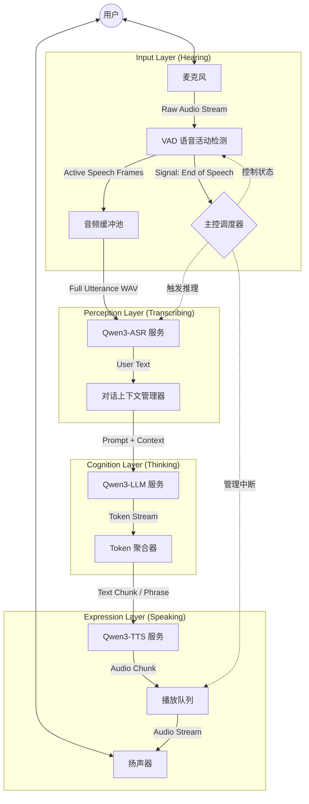

# 🤖 Mybot 架构设计与开发路线图

## 1. 项目愿景与技术约束

**目标:** 构建一个全流程、低延迟、具备自然语音交互能力的机器人助手。
**核心理念:** "Turn-based Streaming" (基于轮次的流式交互)。虽然受限于当前 ASR 后端能力无法做到完全的全双工（边说边识别），但我们通过流水线优化，确保系统在用户说话结束后以最快速度响应。

**技术约束 (基于 MVP 阶段):**
*   **显存预算:** < 8GB (RTX 4060 Laptop)。
    *   **验证结论:** 实测 ASR(FP16)+TTS(FP16)+LLM(1.7B-FP8) 静态占用约 6GB，剩余 2GB 动态空间，可行但需谨慎。
    *   **后端:** 纯 Transformers (不依赖 vLLM 复杂部署，易于调试)。
    *   **ASR:** 非流式 (需 VAD 检测句子结束)。
    *   **LLM:** **双模态 (Dual-mode)**。
        *   *Mode A (API)*: deepseek/gemini 格式接口 (主推，低显存/高智能)。
        *   *Mode B (Local)*: 1.7B-FP8 + 上下文滑动窗口 (隐私/离线)。
    *   **TTS:** **语段级流式 (Phrase-level Streaming)**。不需等待整句，利用逗号或语义停顿进行切分，实现更低延迟。

**开发规范**: !!! 重要: 执行开发或代码修改之前务必阅读已有代码与官方文档和范例代码（最佳实践）

---

## 2. 系统架构设计

系统采用 **模块化流水线 (Modular Pipeline)** 架构，通过 Python 的 `Queue` 和 `Threading` 实现模块间的异步解耦，最大化利用 I/O 等待时间。

### 2.1 数据流架构 (Mermaid)



### 2.2 核心模块规范

#### 1. Input Layer (输入层)
*   **`Microphone`**: 负责底层 PyAudio 封装，以固定 chunk size (如 480 帧/30ms) 读取音频。
*   **`VadDetector`**: 核心组件。
    *   **算法**: WebRTC VAD (Mode 3)。
    *   **逻辑**: 维护一个环形缓冲区 (Ring Buffer)。
        *   *Trigger*: 连续 N 帧语音 -> 状态转为 SPEECH，开始录音。
        *   *Release*: 连续 M 帧静音 -> 状态转为 SILENCE，提交录音数据。
    *   **输出**: 完整的 `bytes` 音频段 (User Utterance)。

#### 2. Perception Layer (感知层)
*   **`ASRClient`**:
    *   **输入**: 完整的语音 `bytes` 或 `np.ndarray`。
    *   **处理**: 调用 `Qwen3ASRModel.transcribe`。
    *   **输出**: 清理后的文本字符串。
    *   **优化**: 预热模型，避免首字延迟。

#### 3. Cognition Layer (认知层)
*   **`LLMInterface` (抽象接口)**:
    *   定义统一的 `stream_chat(history, system_prompt)` 方法。
*   **`OpenAILLMClient` (API 实现)**:
    *   **底层**: `openai.OpenAI` 客户端 (兼容 DashScope/DeepSeek)。
    *   **优势**: 零显存占用，极低延迟 (Time to First Token)。
*   **`LocalLLMClient` (本地 实现)**:
    *   **底层**: `transformers.TextIteratorStreamer` + Qwen3-1.7B。
    *   **显存保护**: 严格执行 Context Window (如保留最近 10 轮)，必要时主动 GC。
*   **`TokenAggregator` (流式处理核心)**:
    *   **职责**: 将破碎的 Token 流聚合成适合 TTS 的 **语段 (Chunks)**。
    *   **逻辑**: 
        *   不仅检测句末符号 (。！？)，也检测 **短语分隔符** (，；、, ;)。
        *   一旦匹配到标点，或者缓冲区文本长度超过阈值（如 10-15 字），立即切分并送入 TTS。
        *   这比等待整句能显著降低首字延迟 (Time to First Audio)。

#### 4. Expression Layer (表达层)
*   **`TTSClient`**:
    *   **输入**: 文本语段 (Text Chunk)。
    *   **处理**: `Qwen3TTSModel.generate`。尽管是调用生成接口，但因为输入是短语，生成速度极快。
    *   **输出**: 音频数据。*   **`AudioPlayer`**:
    *   **结构**: 包含一个线程安全的 `Queue`。
    *   **逻辑**: 独立的播放线程。只要队列不为空就取数据播放；队列为空则等待。确保前一句播放时，TTS 正在合成下一句 (Pipeline 并行)。

#### 5. Orchestrator (主控)
*   **职责**: 状态机管理。
    *   `STATE_IDLE`: 等待唤醒 (可选)。
    *   `STATE_LISTENING`: 麦克风开启，VAD 激活。
    *   `STATE_PROCESSING`: ASR 和 LLM 推理中。
    *   `STATE_SPEAKING`: TTS 播放中 (此时通常需暂停 VAD 或忽略输入，避免自言自语被录入)。

---

## 3. 数据结构定义

为了规范模块间通信，定义标准数据包：

```python
# 1. VAD 输出 / ASR 输入
class AudioSegment:
    data: bytes          # 16kHz, Mono, PCM16
    sample_rate: int = 16000
    duration_ms: int

# 2. ASR 输出 / LLM 输入
class UserQuery:
    text: str
    timestamp: float

# 3. LLM 输出流 (Generator yield)
class LLMToken:
    content: str
    is_eos: bool

# 4. TokenAggregator 输出 / TTS 输入
class TextSentence:
    text: str
    index: int           # 句子序号，用于排序或调试
    is_final: bool       # 是否为回复的最后一句

# 5. TTS 输出 / Player 输入
class AudioPacket:
    audio: np.ndarray    # Float32 or Int16
    sample_rate: int
```

---

## 4. 详细开发路线图 (Development Roadmap)

采用 **"测试驱动 + 模块递进"** 的策略，每一步都产出可运行、可测试的代码。

### Phase 1: 基础听觉构建 (The Ear)
*   **目标**: 能够准确检测人声，录制清晰的音频片段。
*   **任务**:
    1.  实现 `Microphone` 类 (基于 PyAudio)。
    2.  实现 `VadDetector` 类 (基于 webrtcvad)。
    3.  **集成测试**: 编写脚本，对着麦克风说话，程序自动在说话结束后保存 `test_vad.wav`。
*   **交付物**: `bot/core/asr/microphone.py`, `bot/core/asr/vad.py`, `tests/test_mic_vad.py`

### Phase 2: 感知与表达 (Perception & Expression)
*   **目标**: 跑通 ASR 和 TTS 的独立模型推理。
*   **任务**:
    1.  实现 `ASRClient`: 加载 Qwen3-ASR，封装推理接口。
    2.  实现 `TTSClient`: 加载 Qwen3-TTS，封装合成接口。
    3.  实现 `AudioPlayer`: 音频播放队列。
    4.  **集成测试 (Echo Bot)**: 录音 -> ASR转文本 -> 打印文本 -> TTS转语音 -> 播放。实现一个"复读机"。
*   **交付物**: `bot/core/asr/asr_client.py`, `bot/core/tts/tts_client.py`, `bot/core/tts/player.py`, `examples/echo_bot.py`

### Phase 3: 大脑接入与流式优化 (The Brain & Streaming)
*   **目标**: 接入 LLM (优先 API，预留本地接口)，实现文本流到语音流的流水线。
*   **任务**:
    1.  实现 `LLMInterface` 及 `OpenAILLMClient` (API 模式)。
    2.  (Optional) 实现 `LocalLLMClient` (本地模式) 并验证显存稳定性。
    3.  实现 `TokenAggregator`: 复杂的断句逻辑处理。
    4.  **集成测试 (Chat Bot)**: 完整的对话链路。
    5.  **性能调优**: 测量 "ASR结束" 到 "TTS首声" 的延迟 (Latency Profiling)。
*   **交付物**: `bot/core/llm/llm_client.py`, `bot/core/llm/streamer.py`, `main.py`

### Phase 4: 系统完善 (Polishing)
*   **目标**: 提升交互体验。
*   **任务**:
    1.  **打断机制 (Interrupt)**: 用户说话时强制停止 TTS。
    2.  **提示音 (Sound Effects)**: 唤醒音、思考时的填充音 (Filler words)。
    3.  **配置管理**: 统一管理模型路径、硬件参数。
*   **交付物**: 完整的工程化项目。

---

## 5. 测试策略

为每个模块编写单元测试 (Unit Tests) 和 独立运行脚本 (Runner Scripts)。

*   **ASR 测试**: 准备固定的 `sample.wav`，断言识别结果包含特定关键词。
*   **VAD 测试**: 播放一段包含静音和人声的音频注入 VAD，验证切分点。
*   **TTS 测试**: 输入文本，验证生成的音频时长和非空。
*   **Pipeline 测试**: 记录 Log，分析各阶段时间戳。

## 6. 目录结构规划 (Target Structure)

```text
bot/
├── core/
│   ├── asr/
│   │   ├── microphone.py
│   │   ├── vad.py
│   │   └── asr_client.py
│   ├── llm/
│   │   ├── llm_client.py
│   │   └── streamer.py
│   ├── tts/
│   │   ├── tts_client.py
│   │   └── player.py
│   └── orchestrator.py   # 核心调度
├── config/
│   └── settings.yaml     # 模型路径、参数
├── tests/                # 单元测试
├── main.py               # 入口
└── requirements.txt
```
